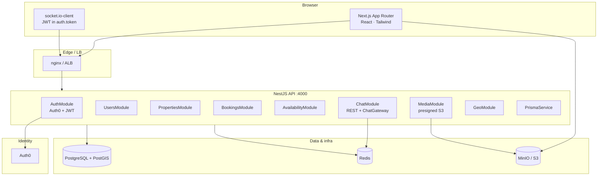
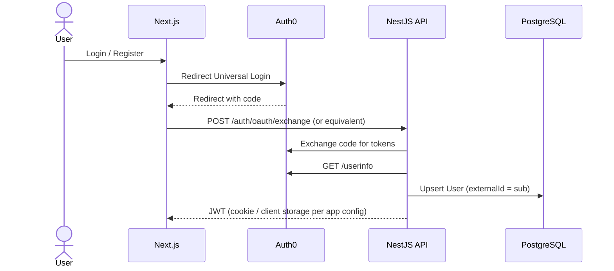
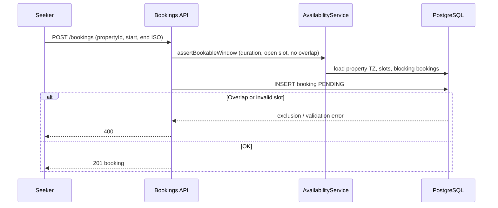
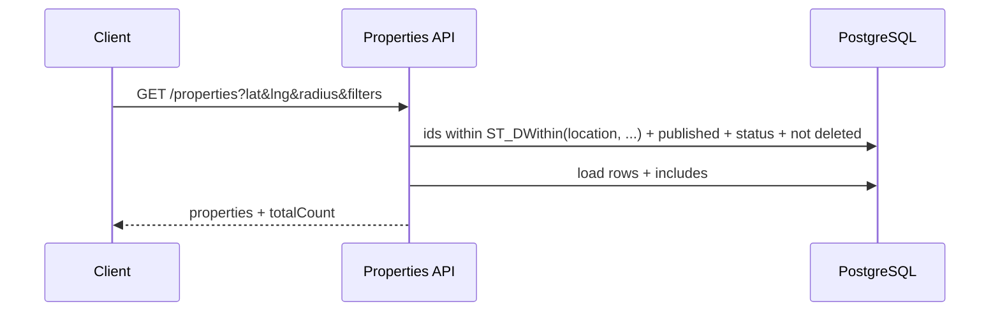

# ProperT — Architecture

Canonical technical specification: stack, **software architecture**, **database** (full Prisma schema below), **flows**, API patterns, and conventions.

- **Delivery status:** [`ROADMAP.md`](ROADMAP.md)
- **Setup / repo:** root [`README.md`](README.md)
- **Authoritative schema source:** [`backend/prisma/schema.prisma`](backend/prisma/schema.prisma) — the block in §4 duplicates it for docs; if they diverge, **`schema.prisma` wins**.

---

## Table of contents

1. [Executive summary](#1-executive-summary)
2. [Software architecture](#2-software-architecture)
3. [Non-functional targets](#3-non-functional-targets)
4. [Database — Prisma schema](#4-database--prisma-schema)
5. [Database — PostgreSQL additions](#5-database--postgresql-additions)
6. [Entity relationship diagram](#6-entity-relationship-diagram)
7. [Flows](#7-flows)
8. [API overview](#8-api-overview)
9. [Infrastructure](#9-infrastructure)
10. [Product conventions](#10-product-conventions)

---

## 1. Executive summary

ProperT is a property marketplace: **Auth0** identity, **NestJS** API, **Next.js** frontend, **PostgreSQL + PostGIS**, **Redis** (cache / Socket.IO scale-out), **S3-compatible** storage.

| Concern | Approach |
|---------|----------|
| **Identity** | Auth0 Universal Login; `User.externalId` = Auth0 `sub`; internal UUID in JWT `sub` for API/WebSocket |
| **Listings** | Table **`properties`**. **Draft** = `publishedAt IS NULL`. Status: `FOR_SALE`, `FOR_RENT`, `CLOSED`. Structured address + **`time_zone`** (IANA) for availability/bookings |
| **Bookings** | Table **`bookings`**; overlap prevented in DB for active statuses; statuses include `COMPLETED`, `LAPSED`; **`note_history`** audit trail |
| **Availability** | Table **`property_availabilities`**; slots computed in listing **time zone** (30-minute steps) |
| **Chat** | Tables **`conversations`**, **`conversation_participants`**, **`messages`**; Socket.IO with **JWT-derived sender**; pagination, archive, edit/reply |
| **Search / geo** | PostGIS radius + filters; optional **`search_vector`** FTS on **`properties`** (see §5) |

**Authorization:** No role enums — data-driven (`ownerId`, seeker, conversation membership).

---

## 2. Software architecture

### 2.1 — System diagram



### 2.2 — Backend modules (conceptual)

| Module | Responsibility |
|--------|----------------|
| **AuthModule** | OAuth code exchange, JWT issuance, Auth0 profile upsert |
| **UsersModule** | User CRUD / public profile |
| **PropertiesModule** | Listings CRUD, public catalog, geo search, soft delete |
| **BookingsModule** | Create/update bookings, role-based status + notes |
| **AvailabilityModule** | Owner schedule CRUD, **open slots** API for a calendar day |
| **ChatModule** | Conversations, messages (REST pagination + WS fan-out), archive |
| **MediaModule** | Presigned PUT URLs for uploads |
| **GeoModule** | Geocoding helpers (if enabled) |

---

## 3. Non-functional targets

| ID | Area | Target / note |
|----|------|----------------|
| NF-1 | Throughput | Scale API horizontally; Redis adapter for Socket.IO when multi-instance |
| NF-2 | Search | Sub-second cached where Redis FTS cache is enabled |
| NF-3 | Media | Direct browser → S3 via presign; API does not stream large bodies |
| NF-4 | Security | JWT on REST; WS verifies JWT on connection; **never trust client `senderId`** |
| NF-5 | Bookings | DB exclusion constraint for overlapping **PENDING/CONFIRMED** windows |
| NF-6 | Data | Soft-delete listings; **RESTRICT** deleting `properties` if **conversations** reference them |

---

## 4. Database — Prisma schema

The following is the **full** `schema.prisma` models and enums as of this document (sync from repo if needed).

```prisma
generator client {
  provider = "prisma-client-js"
}

datasource db {
  provider = "postgresql"
  url      = env("DATABASE_URL")
}

// ─── Enums ────────────────────────────────────────────────────────────────────

enum PropertyType {
  APARTMENT
  HOUSE
  OFFICE
}

/// Listing intent / lifecycle: live sale/rent vs off-market. Draft is `publishedAt IS NULL`, not a status value.
enum PropertyStatus {
  FOR_SALE
  FOR_RENT
  CLOSED

  @@map("PropertyStatus")
}

enum BookingStatus {
  PENDING
  CONFIRMED
  REJECTED
  CANCELLED
  COMPLETED
  LAPSED
}

enum AmenityType {
  SWIMMING_POOL
  GYM
  PARKING
  ELEVATOR
  BALCONY
  AIR_CONDITIONING
  GARDEN
  FIREPLACE
  PET_FRIENDLY
  FURNISHED
  WASHER_DRYER
  DISHWASHER
}

enum MediaType {
  IMAGE
  VIDEO
  FILE
}

// ─── Models ───────────────────────────────────────────────────────────────────

model User {
  id               String    @id @default(uuid())
  email            String    @unique @db.VarChar(254)
  /// Auth0 subject claim (`sub`) — required
  externalId       String    @unique @map("external_id")

  firstName        String    @db.VarChar(100) @map("first_name")
  lastName         String    @db.VarChar(100) @map("last_name")
  /// Profile image URL (Auth0 `picture` or generated initials fallback). Required; not overwritten on later logins once set.
  avatar           String    @db.VarChar(2048)

  createdAt        DateTime  @default(now()) @map("created_at")
  updatedAt        DateTime  @updatedAt @map("updated_at")

  properties       Property[]
  bookings         Booking[]
  sentMessages              Message[]
  conversationParticipants  ConversationParticipant[]
  seekerConversations       Conversation[] @relation("ConversationSeeker")
  ownerConversations        Conversation[] @relation("ConversationOwner")
}

model Property {
  id          String         @id @default(uuid())
  /// URL-safe unique segment for public links (e.g. /properties/gorgeous-loft-brooklyn-a3f2c1)
  slug        String         @unique @db.VarChar(200)
  title       String         @db.VarChar(255)
  description String
  /// FOR_SALE | FOR_RENT = intent; CLOSED = off-market (still visible to owner per UX). Draft = publishedAt IS NULL.
  status      PropertyStatus @default(FOR_SALE)
  /// Sale: listing price. Rent: monthly rent (same column).
  price       Decimal        @db.Decimal(12, 2)
  sqft        Float
  negotiable  Boolean        @default(true)
  bedrooms    Float?
  bathrooms   Float?
  type        PropertyType

  addressLine String         @db.VarChar(500) @map("address_line")
  city        String         @db.VarChar(100)
  country     String         @db.VarChar(100)
  region      String?        @db.VarChar(100)
  postalCode  String?        @map("postal_code") @db.VarChar(32)

  latitude    Float?
  longitude   Float?

  /// External embed (Matterport, etc.) — no self-hosted 360 video
  virtualTourUrl String?   @db.VarChar(2048) @map("virtual_tour_url")
  floorPlanUrl   String?   @db.VarChar(2048) @map("floor_plan_url")

  currency         String   @default("USD") @db.VarChar(3)
  yearBuilt            Int?      @map("year_built")
  views                Int       @default(0)
  availableFrom        DateTime? @map("available_from")
  leaseDurationMonths  Int?      @map("lease_duration_months")

  ownerId     String   @map("owner_id")
  owner       User     @relation(fields: [ownerId], references: [id])
  publishedAt DateTime? @map("published_at")
  createdAt   DateTime  @default(now()) @map("created_at")
  updatedAt   DateTime  @updatedAt @map("updated_at")
  deletedAt   DateTime? @map("deleted_at")

  /// IANA time zone (e.g. America/New_York). Weekly `day_of_week` and `start_time` / `end_time` on
  /// property_availabilities are interpreted in this zone. Default "UTC" when omitted at create.
  timeZone    String   @default("UTC") @map("time_zone") @db.VarChar(64)

  images        PropertyImage[]
  amenities     PropertyAmenity[]
  bookings      Booking[]
  availabilities PropertyAvailability[]
  conversations Conversation[]

  @@map("properties")
  @@index([price])
  @@index([ownerId])
}

model PropertyImage {
  id        String   @id @default(uuid())
  url       String   @db.VarChar(2048)
  key       String   @db.VarChar(1024)
  altText   String   @db.VarChar(255) @map("alt_text")
  isPrimary Boolean  @default(false) @map("is_primary")
  sortOrder Int      @default(0) @map("sort_order")

  propertyId String   @map("property_id")
  property   Property @relation(fields: [propertyId], references: [id], onDelete: Cascade)

  createdAt  DateTime @default(now()) @map("created_at")

  @@index([propertyId, sortOrder])
  @@index([propertyId, isPrimary])
  @@map("PropertyImage")
}

model PropertyAmenity {
  propertyId String      @map("property_id")
  property   Property    @relation(fields: [propertyId], references: [id], onDelete: Cascade)
  amenity    AmenityType

  @@id([propertyId, amenity])
  @@index([amenity])
  @@map("property_amenities")
}

model PropertyAvailability {
  id        String    @id @default(uuid())
  dayOfWeek Int?      @map("day_of_week")
  date      DateTime?
  startTime String    @map("start_time")
  endTime   String    @map("end_time")

  propertyId String   @map("property_id")
  property   Property @relation(fields: [propertyId], references: [id], onDelete: Cascade)

  @@index([propertyId])
  @@map("property_availabilities")
}

model Booking {
  id        String        @id @default(uuid())
  startTime DateTime      @map("start_time")
  endTime   DateTime      @map("end_time")
  status    BookingStatus @default(PENDING)
  /// Freeform note on create (legacy / display); mutating changes append to `noteHistory`.
  notes       String?
  /// Newest-first audit lines: `[ISO8601] OWNER|SEEKER|SYSTEM: text` joined with newlines.
  noteHistory String?     @map("note_history") @db.Text

  propertyId String   @map("property_id")
  property   Property @relation(fields: [propertyId], references: [id], onDelete: Cascade)

  seekerId  String   @map("seeker_id")
  seeker    User     @relation(fields: [seekerId], references: [id], onDelete: Restrict)

  createdAt DateTime @default(now()) @map("created_at")
  updatedAt DateTime @updatedAt @map("updated_at")

  @@index([propertyId, startTime])
  @@index([seekerId, status])
  @@map("bookings")
}

model Conversation {
  id         String @id @default(uuid())

  propertyId String   @map("property_id")
  property   Property @relation(fields: [propertyId], references: [id], onDelete: Restrict)

  seekerId String @map("seeker_id")
  seeker   User   @relation("ConversationSeeker", fields: [seekerId], references: [id])

  ownerId String @map("owner_id")
  owner   User   @relation("ConversationOwner", fields: [ownerId], references: [id])

  /// Latest message time for inbox ordering (denormalized).
  lastMessageAt      DateTime? @map("last_message_at")
  /// Truncated snippet for conversation list (denormalized).
  lastMessagePreview String?   @map("last_message_preview") @db.VarChar(512)

  participants ConversationParticipant[]
  messages     Message[]

  createdAt DateTime @default(now()) @map("created_at")
  updatedAt DateTime @updatedAt @map("updated_at")

  @@unique([propertyId, seekerId, ownerId])
  @@index([propertyId])
  @@map("conversations")
}

model ConversationParticipant {
  userId String @map("user_id")
  user   User   @relation(fields: [userId], references: [id])

  conversationId String       @map("conversation_id")
  conversation   Conversation @relation(fields: [conversationId], references: [id])

  lastReadMessageId String?   @map("last_read_message_id")
  lastReadMessage   Message?  @relation("LastRead", fields: [lastReadMessageId], references: [id], onDelete: SetNull)
  lastReadAt        DateTime? @map("last_read_at")

  /// Null = visible in main inbox; set to hide without deleting history.
  archivedAt DateTime? @map("archived_at")

  @@id([userId, conversationId])
  @@index([conversationId])
  @@map("conversation_participants")
}

model Message {
  id        String  @id @default(uuid())
  content   String?
  mediaUrl  String?   @db.VarChar(2048) @map("media_url")
  mediaType MediaType? @map("media_type")

  conversationId String       @map("conversation_id")
  conversation   Conversation @relation(fields: [conversationId], references: [id])

  senderId String @map("sender_id")
  sender   User   @relation(fields: [senderId], references: [id])

  editedAt DateTime? @map("edited_at")

  replyToMessageId String?  @map("reply_to_message_id")
  replyToMessage   Message? @relation("MessageReplyThread", fields: [replyToMessageId], references: [id], onDelete: SetNull)
  replies          Message[] @relation("MessageReplyThread")

  readPointers ConversationParticipant[] @relation("LastRead")

  createdAt DateTime @default(now()) @map("created_at")

  @@index([conversationId, createdAt])
  @@index([replyToMessageId])
  @@map("messages")
}
```

---

## 5. Database — PostgreSQL additions

These are applied via migrations (not all expressed in Prisma). Typical items:

```sql
-- Extension for booking range exclusion
CREATE EXTENSION IF NOT EXISTS btree_gist;

-- Overlapping bookings (same property, overlapping time range) —
-- only for statuses that "hold" the calendar
ALTER TABLE "bookings" ADD CONSTRAINT booking_no_overlap
  EXCLUDE USING GIST (
    "property_id"  WITH =,
    tsrange("start_time", "end_time", '[)') WITH &&
  )
  WHERE (status IN ('PENDING', 'CONFIRMED'));

-- Geo + FTS on listings (table "properties")
-- - geography(Point,4326) generated column `location` + GiST index
-- - tsvector `search_vector` + GIN index
-- - CHECK currency ~ '^[A-Z]{3}$'

-- One primary image per property (partial unique index on PropertyImage)

-- Availability: exactly one of (day_of_week, date) — CHECK constraints on property_availabilities

-- Messages: content OR media required — CHECK on messages
```

Exact DDL lives under **`backend/prisma/migrations/`**.

---

## 6. Entity relationship diagram

```mermaid
erDiagram
  USER {
    uuid id PK
    string email UK
    string external_id UK
    string first_name
    string last_name
    string avatar
    datetime created_at
    datetime updated_at
  }

  PROPERTY {
    uuid id PK
    string slug UK
    string title
    text description
    enum status
    decimal price
    float sqft
    boolean negotiable
    float bedrooms
    float bathrooms
    enum type
    string address_line
    string city
    string country
    string region
    string postal_code
    float latitude
    float longitude
    string virtual_tour_url
    string floor_plan_url
    string currency
    int year_built
    int views
    datetime available_from
    int lease_duration_months
    uuid owner_id FK
    datetime published_at
    datetime created_at
    datetime updated_at
    datetime deleted_at
    string time_zone
  }

  PROPERTY_IMAGE {
    uuid id PK
    string url
    string key
    string alt_text
    boolean is_primary
    int sort_order
    uuid property_id FK
    datetime created_at
  }

  PROPERTY_AMENITY {
    uuid property_id PK_FK
    enum amenity PK
  }

  PROPERTY_AVAILABILITY {
    uuid id PK
    int day_of_week
    datetime date
    string start_time
    string end_time
    uuid property_id FK
  }

  BOOKING {
    uuid id PK
    datetime start_time
    datetime end_time
    enum status
    text notes
    text note_history
    uuid property_id FK
    uuid seeker_id FK
    datetime created_at
    datetime updated_at
  }

  CONVERSATION {
    uuid id PK
    uuid property_id FK
    uuid seeker_id FK
    uuid owner_id FK
    datetime last_message_at
    string last_message_preview
    datetime created_at
    datetime updated_at
  }

  CONVERSATION_PARTICIPANT {
    uuid user_id PK_FK
    uuid conversation_id PK_FK
    uuid last_read_message_id FK
    datetime last_read_at
    datetime archived_at
  }

  MESSAGE {
    uuid id PK
    text content
    string media_url
    enum media_type
    uuid conversation_id FK
    uuid sender_id FK
    datetime edited_at
    uuid reply_to_message_id FK
    datetime created_at
  }

  USER ||--o{ PROPERTY : owns
  USER ||--o{ BOOKING : seeks
  USER ||--o{ MESSAGE : sends
  USER ||--o{ CONVERSATION_PARTICIPANT : participates
  PROPERTY ||--o{ PROPERTY_IMAGE : has
  PROPERTY ||--o{ PROPERTY_AMENITY : has
  PROPERTY ||--o{ PROPERTY_AVAILABILITY : has
  PROPERTY ||--o{ BOOKING : receives
  PROPERTY ||--o{ CONVERSATION : context
  CONVERSATION ||--o{ CONVERSATION_PARTICIPANT : members
  CONVERSATION ||--o{ MESSAGE : contains
  MESSAGE ||--o{ CONVERSATION_PARTICIPANT : last_read
```

---

## 7. Flows

### 7.1 — Authentication (Auth0 → ProperT JWT)



### 7.2 — Chat (REST thread + Socket.IO)

```mermaid
sequenceDiagram
  participant Seeker as Seeker browser
  participant API as REST API
  participant GW as ChatGateway
  participant DB as PostgreSQL

  Seeker->>API: POST /chat/conversations (propertyId, ownerId)
  API->>DB: getOrCreate conversation + participants
  API-->>Seeker: conversation id

  Seeker->>GW: WebSocket connect (JWT in handshake auth)
  GW->>GW: verify JWT → userId
  Seeker->>GW: joinRoom(conversationId)
  GW->>DB: ensure participant

  Seeker->>GW: sendMessage (content / optional media / optional replyTo)
  GW->>DB: insert Message; update conversation last_message_*
  GW-->>Seeker: broadcast newMessage to room
```

### 7.3 — Booking (slot + overlap)



### 7.4 — Property search (radius)



### 7.5 — Listing create / publish (conceptual)

```mermaid
sequenceDiagram
  participant Owner
  participant API as Properties API
  participant DB as PostgreSQL

  Owner->>API: POST /properties (publish false → draft)
  API->>DB: INSERT property published_at null
  Owner->>API: PATCH /properties/:id (publish true)
  API->>DB: validate; set published_at
```

---

## 8. API overview

Representative routes (see Nest controllers for full list):

| Area | Examples |
|------|-----------|
| Auth | OAuth exchange, refresh |
| Users | Profile |
| Properties | CRUD, `GET /properties` geo search, `GET /properties/mine`, `PATCH` publish |
| Bookings | `POST`, `GET .../mine`, `PATCH` with note + transitions |
| Availability | `GET/PUT .../properties/:id/availability`, slots query |
| Chat | `GET /chat/conversations?folder=`, `GET /chat/messages/:conversationId?cursor`, `PATCH` archive, `PATCH` edit message |
| Media | Presign upload |

WebSocket events: **`joinRoom`**, **`sendMessage`** (server uses JWT user, not body `senderId`).

---

## 9. Infrastructure

| Component | Use |
|-----------|-----|
| **PostgreSQL + PostGIS** | Primary store, GiST geo, GIST exclusion on bookings, optional FTS |
| **Redis** | Socket.IO adapter, throttling, optional search cache TTL ~60s |
| **S3 / MinIO** | Media; presigned PUT |

Environment variables: see **`.env.example`** (never commit secrets).

---

## 10. Product conventions

1. **Discovery (public):** `published_at IS NOT NULL`, status in `FOR_SALE` / `FOR_RENT`, `deleted_at IS NULL`. **Draft** detail URLs require auth as participant (owner) where enforced.
2. **Off-market:** `CLOSED` or soft-delete; exclude from browse per query rules.
3. **Time zones:** Listing **`time_zone`** is authoritative for availability slots and booking window validation; UI should align date pickers where implemented.
4. **Chat archive:** Per-user **`archived_at`** on **`conversation_participants`** — history retained.
5. **Virtual tours:** Embed URL only (`virtualTourUrl`), not uploaded 360° video pipelines.
6. **No `.ics` / external calendar export** unless product adds it later.

---

*Document revision: 2026-05-04 — includes full Prisma schema snapshot and flow diagrams.*
