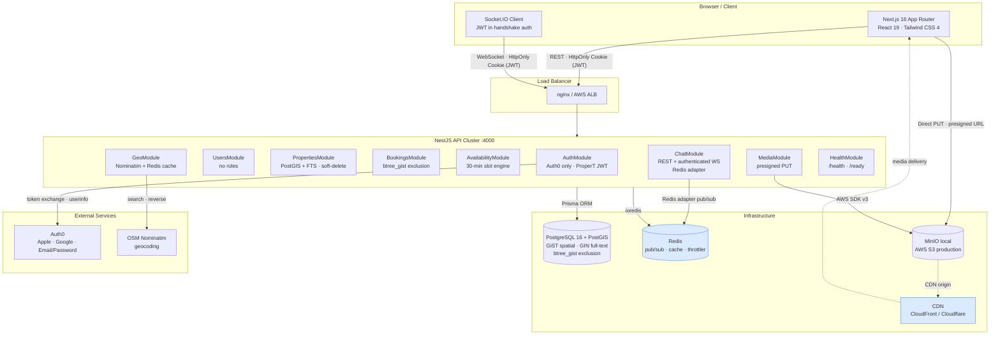
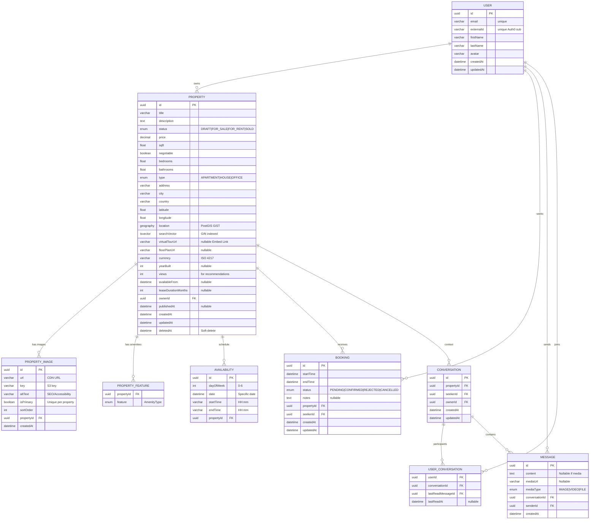
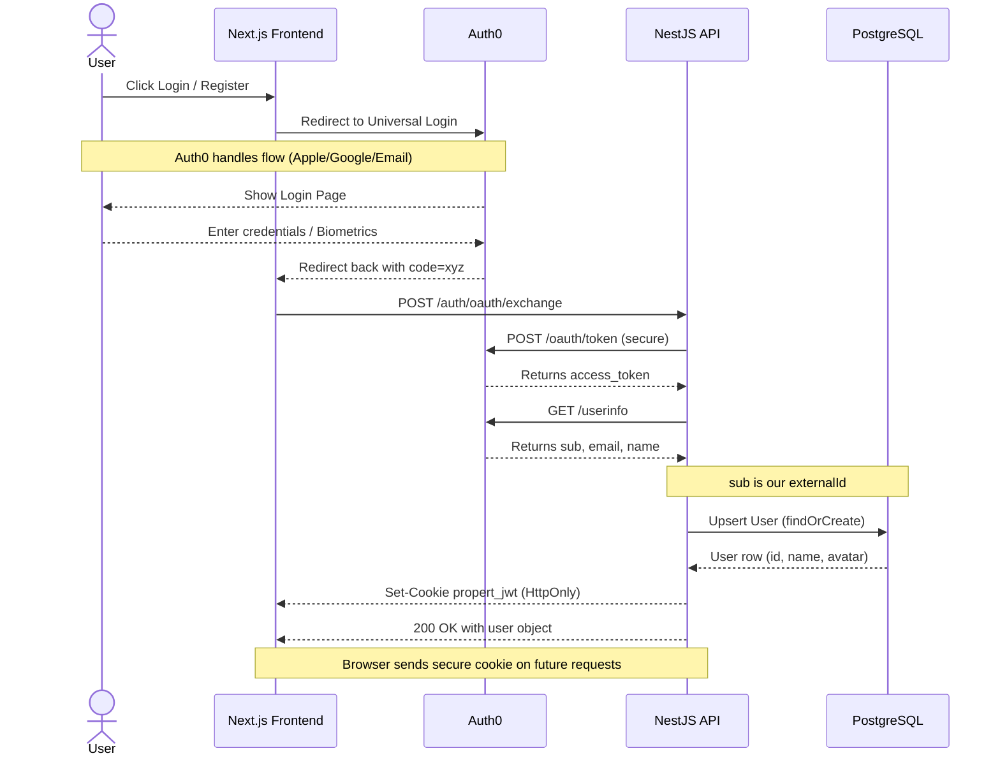
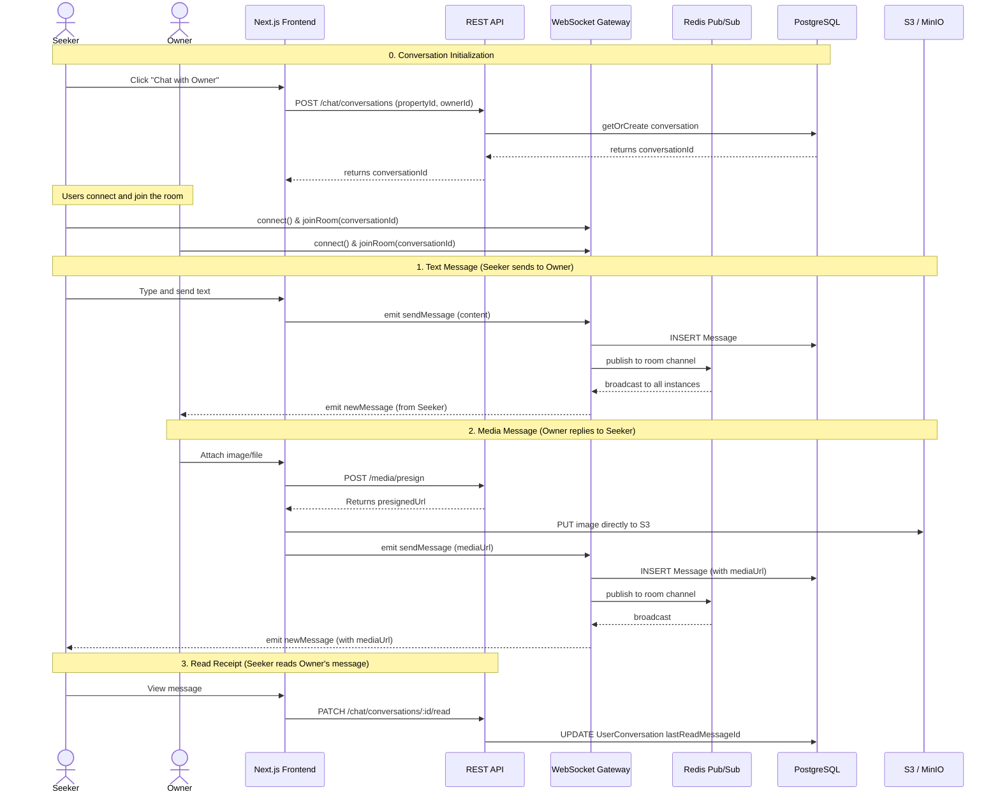
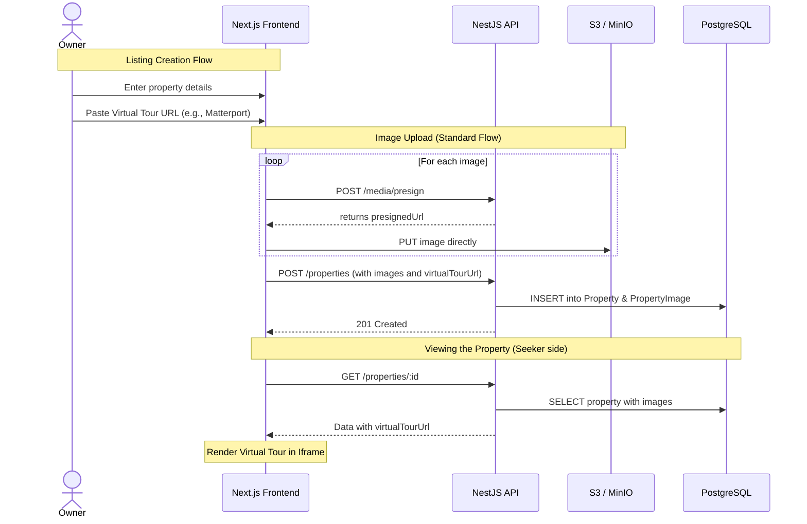
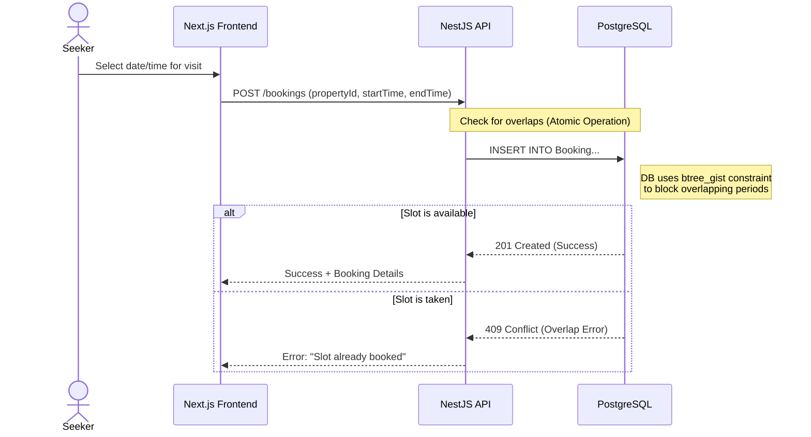
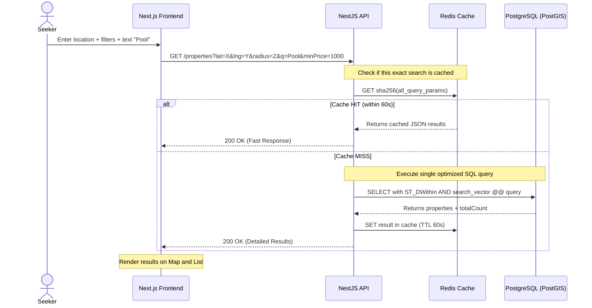

# ProperT — Architecture

This document is the **canonical technical specification** for ProperT: stack choices, system design, data model, API behavior, feature requirements, flows, and infrastructure targets. **Implementation order and delivery status** live in [`ROADMAP.md`](ROADMAP.md). All product and engineering work should align with this spec unless explicitly revised here.

**Local setup, environment variables, repository layout, and day-to-day contributor notes** live in **`README.md`** at the repository root. If anything in `README.md` disagrees with this document, **this file wins**.

---

## Table of Contents

1. [Executive Summary](#1-executive-summary)
2. [Feature Requirements](#2-feature-requirements)
3. [Non-Functional Requirements](#3-non-functional-requirements)
4. [Key Technical Decisions](#4-key-technical-decisions)
5. [System Architecture](#5-system-architecture)
6. [Database Schema](#6-database-schema)
7. [Feature Flow Diagrams](#7-feature-flow-diagrams)
8. [API Contract](#8-api-contract)
9. [Infrastructure](#9-infrastructure)
10. [Product conventions](#10-product-conventions)

---

## 1. Executive Summary

ProperT is a property marketplace with **Auth0-based authentication**, a **NestJS** API, **Next.js** frontend, **PostgreSQL + PostGIS** for geo and full-text search, **Redis** for caching and real-time scale-out, and **S3-compatible storage** for media. Key architectural pillars:

- **Identity:** Auth0 Universal Login (Apple, Google, email/password). Each `User` row is keyed by **`externalId`** = Auth0 `sub`. ProperT issues an **HttpOnly JWT** cookie for API and WebSocket access. **No role enums** — authorization is **data-driven** (e.g. `ownerId` on `Property`, participation on `Conversation`).
- **Chat:** Conversations are **created via REST** (`POST /chat/conversations`) before Socket.IO use. **Bidirectional** messaging over authenticated WebSockets; media uploads use **presigned PUT to S3** so the API never handles raw bytes. **Last-read** state lives on `UserConversation`.
- **Search:** One **parameterized SQL** query combining **PostGIS** radius, **`tsvector`** full-text search, and filters; responses cached in **Redis** for **60 seconds** per query fingerprint. **`SOLD`** listings are **out of discovery** (search, map, recommendations — same rule as soft-deleted for public surfaces; see §10).
- **Bookings:** Overlapping viewing slots are prevented with a PostgreSQL **`btree_gist` exclusion constraint** on `(property_id, time range)` — concurrent requests resolve to one success and one **409 Conflict**.
- **Listings:** Structured **`address`, `city`, `country`** (required). **Virtual tours** are **external embed URLs** (`virtualTourUrl`). Gallery images use **presigned upload**; **thumbnails** are generated **client-side** (Canvas) before upload. **Tax, HOA, self-hosted promo/tour video files, and multipart video pipelines** are **not part** of this architecture.
- **Infrastructure:** **No** background job runners (e.g. BullMQ) or dedicated transcoding workers. Redis supports Socket.IO clustering, throttling, and search caching — not generic job queues.

---

## 2. Feature Requirements

### F-1 — Live Chat with Media (Bidirectional)

| # | Requirement |
|---|-------------|
| F-1-1 | One conversation per `(propertyId, seekerId, ownerId)` — **Seeker MUST initiate** via `POST /chat/conversations` (REST) before WebSocket use |
| F-1-2 | **Seeker** and **Owner** connect to WebSockets using **HttpOnly JWT cookie** (validated on connection) |
| F-1-3 | **Bidirectional messaging:** Seeker may send **text**; Owner may reply with **media** (image/file) — upload via presigned URL, then `sendMessage` with `mediaUrl` |
| F-1-4 | Media: browser obtains presigned URL from REST, **uploads directly to S3** — API never handles raw bytes |
| F-1-5 | Per-user read receipts via `lastReadMessageId` on `UserConversation` |
| F-1-6 | Message history paginated on scroll (cursor-based, `createdAt` desc) |
| F-1-7 | Horizontal scale via Redis Socket.IO adapter |

### F-2 — Property Search

| # | Requirement |
|---|-------------|
| F-2-1 | Geo radius search (lat, lng, radius) via PostGIS GiST |
| F-2-2 | Filters: price range, bedrooms, bathrooms, sqft range, property type, listing status |
| F-2-3 | Free-text `q` via PostgreSQL `tsvector` + GIN |
| F-2-4 | Results paginated, sortable |
| F-2-5 | **Single optimized SQL** combining geo + FTS + filters; **Redis cache** keyed by query hash, **TTL 60s** |
| F-2-6 | **Discovery** (search, map, “similar” / suggested / any recommendation feed): exclude **`status = 'SOLD'`**, **`status = 'DRAFT'`**, and **`deleted_at IS NOT NULL`** — **`SOLD`** is off-market and must not surface like an active listing |

### F-3 — Virtual Tour & Gallery

| # | Requirement |
|---|-------------|
| F-3-1 | **Virtual tour:** Owner pastes an **external embed URL** (e.g., Matterport); stored as nullable `Property.virtualTourUrl` |
| F-3-2 | **Gallery:** Standard image flow — `POST /media/presign`, client **PUT** to S3, then property create/update with image metadata |
| F-3-3 | **Thumbnails** for listing images: generated **client-side** with the **Canvas API** before upload |
| F-3-4 | Virtual tours are **embed links only** — no upload or hosting of 360° video files in object storage |

### F-4 — Property Listing Flow

| # | Requirement |
|---|-------------|
| F-4-1 | No platform fee / tax / HOA fields on `Property` for MVP |
| F-4-2 | `PropertyImage` stores `url`, `key`, **`altText`**, `isPrimary`, `sortOrder`, **`createdAt`** |
| F-4-3 | `PropertyFeature` + `AmenityType` for amenities |
| F-4-4 | Listings support **`DRAFT`** and explicit **publish**; public surfaces exclude drafts |
| F-4-5 | **Address model:** `address`, `city`, and `country` are **required**; there are **no** separate `state` or `zipCode` columns |
| F-4-6 | **Image order** is stored as **`sortOrder`** (and **`isPrimary`**). Reordering in the UI (e.g. drag-and-drop) updates those fields via normal listing PATCH flows — no separate backend feature beyond persisted sort |

### F-5 — Auth0 Only

| # | Requirement |
|---|-------------|
| F-5-1 | No local passwords — **Auth0** Universal Login |
| F-5-2 | **Unified flow:** Apple, Google, and email/password via Auth0 |
| F-5-3 | Backend exchanges **authorization code** for tokens, loads **userinfo**, upserts `User` where **`externalId` = `sub`**, issues **ProperT JWT** as **HttpOnly cookie** |

---

## 3. Non-Functional Requirements

| ID | Requirement | Target |
|----|------------|--------|
| NF-1 | Concurrent users | Thousands of simultaneous users |
| NF-2 | Search latency | < 200 ms p95 cached, < 500 ms cold |
| NF-3 | Media upload | Presigned direct-to-S3; **no large self-hosted video pipeline** |
| NF-4 | Messaging scale | High volume; many concurrent rooms |
| NF-5 | Security | Authenticated WS, rate-limited routes, HttpOnly cookies |
| NF-6 | Booking race condition | Concurrent booking attempts → **one success**, other **409** via DB constraint |
| NF-7 | Horizontal scalability | API instances + Redis adapter for Socket.IO |
| NF-8 | Data integrity | Soft delete on properties; referential integrity on bookings/chat; **`SOLD`** (and **`DRAFT`**) excluded from public discovery per F-2-6 / §10 |

---

## 4. Key Technical Decisions

### D-1 — No User Roles (Data-Driven)

The platform does **not** use role enums or an `isAdmin` flag. Dashboards and authorization derive behavior from data (`ownerId`, `seekerId`, conversation membership).

---

### D-2 — Auth0 Only; `externalId` = `sub`

- Single identity provider: **Auth0**.
- `User.externalId` stores the Auth0 **`sub`** claim (unique, required).
- **No `externalProvider` column** — Auth0 is the only identity provider.
- ProperT issues its own **HttpOnly JWT** cookie after code exchange and user sync.

---

### D-3 — WebSocket Authentication (HttpOnly Cookie)

1. Browser connects to Socket.IO with **credentials** so the **HttpOnly** JWT cookie is sent.
2. `handleConnection` verifies JWT and sets `client.data.userId`.
3. `senderId` from message body is **ignored** — socket identity is authoritative.
4. `joinRoom` verifies conversation membership.

---

### D-4 — Booking: `btree_gist` Exclusion Constraint

Overlapping bookings on the same property are prevented **in the database**:

```sql
CREATE EXTENSION IF NOT EXISTS btree_gist;

ALTER TABLE "Booking" ADD CONSTRAINT booking_no_overlap
  EXCLUDE USING GIST (
    "property_id"  WITH =,
    tstzrange("start_time", "end_time", '[)') WITH &&
  )
  WHERE (status IN ('PENDING', 'CONFIRMED'));
```

Violations map to **409 Conflict**. No app-level overlap race.

---

### D-5 — Read Receipts: Last-Read Pointer

`UserConversation.lastReadMessageId` + `lastReadAt` — no per-message receipt table.

---

### D-6 — Media: Presigned Single-Part Upload

| Step | Endpoint | Notes |
|------|----------|--------|
| Presign | `POST /media/presign` | Returns presigned **single-part** PUT URL + metadata |
| Upload | Browser → S3 | Direct PUT; **NestJS never reads file body** |
| Chat / listing | WS or REST metadata | Store CDN/key references in DB |

**Security:** Private bucket; presigned upload; CDN origin for reads in production.

**Scope:** Multipart S3 uploads for multi-gigabyte objects are **not** used; virtual tours are third-party URLs, not uploaded files.

**Upload size limits (convention):** Reject presign requests above **10 MiB** per file for **chat** attachments and **25 MiB** per file for **listing gallery** images (constants in `MediaModule` / DTO validation; align with reverse-proxy body limits if any).

---

### D-7 — Redis

| Use case | Library / pattern |
|----------|-------------------|
| Socket.IO adapter | `@socket.io/redis-adapter` |
| Rate limiting | `@nestjs/throttler` + Redis |
| Search cache | `ioredis`, **60s TTL**, key = hash of query params |

**No** BullMQ or general-purpose job runners.

---

### D-8 — Single SQL Search + Cache

One query combining `ST_DWithin`, `search_vector @@ query`, filters, **`deleted_at IS NULL`**, **`status` not in `('DRAFT', 'SOLD')`**, pagination — then cache full response for 60 seconds. Recommendation / “suggested listings” queries use the **same visibility predicates** so **`SOLD`** never appears there.

---

### D-9 — Soft Deletes

`Property.deletedAt` — public queries filter active rows only.

---

### D-10 — Virtual Tours Are Embeds

Third-party players (Matterport, etc.) are embedded via **`virtualTourUrl`**. No transcoding, no object storage for 360° video files.

---

## 5. System Architecture



---

## 6. Database Schema

### 6.1 — Prisma Schema

```prisma
generator client {
  provider = "prisma-client-js"
}

datasource db {
  provider = "postgresql"
  url      = env("DATABASE_URL")
}

// ─── Enums ────────────────────────────────────────────────────────────────────

enum PropertyType {
  APARTMENT
  HOUSE
  OFFICE
}

enum PropertyStatus {
  DRAFT
  FOR_SALE
  FOR_RENT
  SOLD
  @@map("ListingStatus")
}

enum BookingStatus {
  PENDING
  CONFIRMED
  REJECTED
  CANCELLED
}

enum AmenityType {
  SWIMMING_POOL
  GYM
  PARKING
  ELEVATOR
  BALCONY
  AIR_CONDITIONING
  GARDEN
  FIREPLACE
  PET_FRIENDLY
  FURNISHED
  WASHER_DRYER
  DISHWASHER
}

enum MediaType {
  IMAGE
  VIDEO
  FILE
}

// ─── Models ───────────────────────────────────────────────────────────────────

model User {
  id               String    @id @default(uuid())
  email            String    @unique @db.VarChar(254)
  /// Auth0 subject claim (`sub`) — required
  externalId       String    @unique @map("external_id")

  firstName        String    @db.VarChar(100) @map("first_name")
  lastName         String    @db.VarChar(100) @map("last_name")
  avatar           String?   @db.VarChar(2048)

  createdAt        DateTime  @default(now()) @map("created_at")
  updatedAt        DateTime  @updatedAt @map("updated_at")

  properties       Property[]
  bookings         Booking[]
  sentMessages     Message[]
  chats            UserConversation[]
  seekerConversations Conversation[] @relation("ConversationSeeker")
  ownerConversations  Conversation[] @relation("ConversationOwner")
}

model Property {
  id          String         @id @default(uuid())
  title       String         @db.VarChar(255)
  description String
  status      PropertyStatus @default(DRAFT)
  price       Decimal        @db.Decimal(12, 2)
  sqft        Float
  negotiable  Boolean        @default(true)
  bedrooms    Float          @default(0)
  bathrooms   Float          @default(0)
  type        PropertyType

  /// Structured address: city-line string plus city and country (no separate state or zip columns)
  address     String         @db.VarChar(500)
  city        String         @db.VarChar(100)
  country     String         @db.VarChar(100)

  latitude    Float?
  longitude   Float?

  /// External embed (Matterport, etc.) — no self-hosted 360 video
  virtualTourUrl String?   @db.VarChar(2048) @map("virtual_tour_url")
  floorPlanUrl   String?   @db.VarChar(2048) @map("floor_plan_url")

  currency         String   @default("USD") @db.VarChar(3)
  yearBuilt            Int?      @map("year_built")
  views                Int       @default(0)
  availableFrom        DateTime? @map("available_from")
  leaseDurationMonths  Int?      @map("lease_duration_months")

  ownerId     String   @map("owner_id")
  owner       User     @relation(fields: [ownerId], references: [id])
  publishedAt DateTime? @map("published_at")
  createdAt   DateTime  @default(now()) @map("created_at")
  updatedAt   DateTime  @updatedAt @map("updated_at")
  deletedAt   DateTime? @map("deleted_at")

  images        PropertyImage[]
  features      PropertyFeature[]
  bookings      Booking[]
  availabilities Availability[]
  conversations Conversation[]

  @@map("Listing")
  @@index([price])
  @@index([ownerId])
}

model PropertyImage {
  id        String   @id @default(uuid())
  url       String   @db.VarChar(2048)
  key       String   @db.VarChar(1024)
  altText   String   @db.VarChar(255) @map("alt_text")
  isPrimary Boolean  @default(false) @map("is_primary")
  sortOrder Int      @default(0) @map("sort_order")

  propertyId String   @map("property_id")
  property   Property @relation(fields: [propertyId], references: [id], onDelete: Cascade)

  createdAt  DateTime @default(now()) @map("created_at")

  @@index([propertyId, sortOrder])
  @@index([propertyId, isPrimary])
  @@map("PropertyImage")
}

model PropertyFeature {
  propertyId String      @map("property_id")
  property   Property    @relation(fields: [propertyId], references: [id], onDelete: Cascade)
  feature    AmenityType

  @@id([propertyId, feature])
  @@index([feature])
  @@map("PropertyFeature")
}

model Availability {
  id        String    @id @default(uuid())
  dayOfWeek Int?      @map("day_of_week")
  date      DateTime?
  startTime String    @map("start_time")
  endTime   String    @map("end_time")

  propertyId String   @map("property_id")
  property   Property @relation(fields: [propertyId], references: [id], onDelete: Cascade)

  @@index([propertyId])
  @@map("Availability")
}

model Booking {
  id        String        @id @default(uuid())
  startTime DateTime      @map("start_time")
  endTime   DateTime      @map("end_time")
  status    BookingStatus @default(PENDING)
  notes     String?

  propertyId String   @map("property_id")
  property   Property @relation(fields: [propertyId], references: [id], onDelete: Cascade)

  seekerId  String   @map("seeker_id")
  seeker    User     @relation(fields: [seekerId], references: [id], onDelete: Restrict)

  createdAt DateTime @default(now()) @map("created_at")
  updatedAt DateTime @updatedAt @map("updated_at")

  @@index([propertyId, startTime])
  @@index([seekerId, status])
  @@map("Booking")
}

model Conversation {
  id         String    @id @default(uuid())

  propertyId String   @map("property_id")
  property   Property @relation(fields: [propertyId], references: [id])

  seekerId   String   @map("seeker_id")
  seeker     User     @relation("ConversationSeeker", fields: [seekerId], references: [id])

  ownerId    String   @map("owner_id")
  owner      User     @relation("ConversationOwner", fields: [ownerId], references: [id])

  participants UserConversation[]
  messages     Message[]

  createdAt  DateTime @default(now()) @map("created_at")
  updatedAt  DateTime @updatedAt @map("updated_at")

  @@unique([propertyId, seekerId, ownerId])
  @@index([propertyId])
  @@map("Conversation")
}

model UserConversation {
  userId         String @map("user_id")
  user           User   @relation(fields: [userId], references: [id])

  conversationId String       @map("conversation_id")
  conversation   Conversation @relation(fields: [conversationId], references: [id])

  lastReadMessageId String?  @map("last_read_message_id")
  lastReadMessage   Message? @relation("LastRead", fields: [lastReadMessageId], references: [id], onDelete: SetNull)
  lastReadAt        DateTime? @map("last_read_at")

  @@id([userId, conversationId])
  @@index([conversationId])
  @@map("UserConversation")
}

model Message {
  id             String    @id @default(uuid())
  content        String?
  mediaUrl       String?   @db.VarChar(2048) @map("media_url")
  mediaType      MediaType? @map("media_type")

  conversationId String       @map("conversation_id")
  conversation   Conversation @relation(fields: [conversationId], references: [id])

  senderId String @map("sender_id")
  sender   User   @relation(fields: [senderId], references: [id])

  readPointers UserConversation[] @relation("LastRead")

  createdAt DateTime @default(now()) @map("created_at")

  @@index([conversationId, createdAt])
  @@map("Message")
}
```

---

### 6.2 — Raw SQL Additions (via Prisma migration `sql` files)

```sql
-- 1. btree_gist extension (required for range exclusion)
CREATE EXTENSION IF NOT EXISTS btree_gist;

-- 2. Booking overlap exclusion constraint
ALTER TABLE "Booking" ADD CONSTRAINT booking_no_overlap
  EXCLUDE USING GIST (
    "property_id"  WITH =,
    tstzrange("start_time", "end_time", '[)') WITH &&
  )
  WHERE (status IN ('PENDING', 'CONFIRMED'));

-- 3. PostGIS generated geography column + GiST index
ALTER TABLE "Listing"
  ADD COLUMN location geography(Point, 4326)
  GENERATED ALWAYS AS (
    CASE
      WHEN latitude IS NOT NULL AND longitude IS NOT NULL
      THEN ST_SetSRID(ST_MakePoint(longitude, latitude), 4326)
      ELSE NULL
    END
  ) STORED;
CREATE INDEX listing_location_gist ON "Listing" USING GIST(location);

-- 4. Full-text search generated tsvector column + GIN index
ALTER TABLE "Listing"
  ADD COLUMN search_vector tsvector
  GENERATED ALWAYS AS (
    to_tsvector('english',
      coalesce(title, '') || ' ' ||
      coalesce(description, '') || ' ' ||
      coalesce(address, '') || ' ' ||
      coalesce(city, '')
    )
  ) STORED;
CREATE INDEX listing_fts_gin ON "Listing" USING GIN(search_vector);

-- 5. Single primary image per property
CREATE UNIQUE INDEX property_one_primary_image
  ON "PropertyImage"(property_id)
  WHERE is_primary = TRUE;

-- 6. Availability: day_of_week XOR date
ALTER TABLE "Availability" ADD CONSTRAINT availability_xor_day_or_date
  CHECK (
    (day_of_week IS NOT NULL AND date IS NULL) OR
    (day_of_week IS NULL AND date IS NOT NULL)
  );
ALTER TABLE "Availability" ADD CONSTRAINT availability_valid_day_of_week
  CHECK (day_of_week IS NULL OR day_of_week BETWEEN 0 AND 6);

-- 7. Message must have content or media
ALTER TABLE "Message" ADD CONSTRAINT message_has_content_or_media
  CHECK (content IS NOT NULL OR media_url IS NOT NULL);

-- 8. Currency format (ISO 4217)
ALTER TABLE "Listing" ADD CONSTRAINT listing_currency_iso4217 CHECK (currency ~ '^[A-Z]{3}$');
```

---

### 6.3 — Entity Relationship Diagram



---

## 7. Feature Flow Diagrams

### 7.1 — Auth Flow (Auth0 → HttpOnly ProperT JWT)



---

### 7.2 — Chat Flow (REST Init + Bidirectional WS + S3 Presign)



---

### 7.3 — Virtual Tour & Gallery (Embed URL + Presigned Images)



---

### 7.4 — Booking Flow (`btree_gist`)



---

### 7.5 — Property Search (Single SQL + 60s Redis Cache)



---

## 8. API Contract

### Auth Transport

- ProperT JWT in **HttpOnly cookie** (e.g., `propert_jwt`).
- REST and Socket.IO handshake send the cookie automatically (same-site configuration).

### Representative Endpoints

| Method | Path | Auth | Description |
|--------|------|------|-------------|
| `POST` | `/auth/oauth/exchange` | Body with OAuth code | Exchange code → userinfo → **Set-Cookie** ProperT JWT |
| `POST` | `/media/presign` | JWT cookie | Presigned **single-part** PUT for uploads |
| `PATCH` | `/chat/conversations/:id/read` | JWT cookie | Last-read pointer |
| `POST` | `/properties/:id/publish` | JWT cookie + owner | Publish listing |
| `GET` | `/health` | None | Liveness |
| `GET` | `/ready` | None | Readiness |

Additional REST routes for properties, bookings, chat, and users follow standard patterns documented in code and OpenAPI (when enabled).

### Out of Scope

- **Multipart S3 upload APIs** for large file assembly (not needed — virtual tours are URLs; gallery uses single-part presign).
- **Role-assignment or legacy password auth** endpoints.
- **Listing financial fields** (tax, HOA) — not modeled in Section 6.
- **Calendar export / “Add to Google Calendar” / iCal (`.ics`)** — not part of the product; bookings are persisted and shown in-app only unless scope changes later.

### WebSocket Events (Summary)

| Event | Notes |
|-------|--------|
| `sendMessage` | `conversationId`, optional `content`, optional `mediaUrl` / `mediaType`; **sender from socket** |
| `joinRoom` | After REST-created conversation; membership verified |

---

## 9. Infrastructure

### Redis

| Use | Notes |
|-----|--------|
| Socket.IO adapter | Multi-instance broadcast |
| Throttler | Auth + geo routes |
| Search cache | **60s TTL**, hash of full query string |

**No** BullMQ, **no** dedicated transcoding workers.

### CDN

Private S3/MinIO bucket; CDN as origin for GETs; presigned PUT for uploads.

### Environment Variables (Representative)

```env
REDIS_URL=redis://localhost:6379
CDN_BASE_URL=https://cdn.propert.com
THROTTLE_TTL_SECONDS=60
THROTTLE_LIMIT_AUTH=5
THROTTLE_LIMIT_GEO=30
```

---

## 10. Product conventions

Decisions that replace former “open questions” and **must** stay consistent across API, SQL, and UI:

1. **No external calendar integration** — No `.ics` download, no Google Calendar API, no “Add to calendar” product requirement. Booking UX stays in-app (email or push reminders are out of scope unless added later).
2. **Upload size caps** — See **D-6**: **10 MiB** (chat), **25 MiB** (gallery) at presign validation unless product revises.
3. **Gallery reordering** — Only **`sortOrder` / `isPrimary`** on `PropertyImage`; drag-and-drop is a **frontend** implementation detail (F-4-6).
4. **No `isAdmin`** — No admin flag on `User` and no separate admin RBAC in this architecture.
5. **Off-market listings** — Public discovery (search, map, recommendations, “similar” / suggested) requires **`deleted_at IS NULL`** and **`status NOT IN ('DRAFT', 'SOLD')`**. **`SOLD`** is treated like **gone from the marketplace** for those surfaces (same net effect as soft-delete for seekers). Owners may still see **`SOLD`** under **my listings** for history if the UI includes them there.

---

*Virtual tours are third-party embeds (`virtualTourUrl`); self-hosted 360° video transcoding is not planned.*

---

**Document revision:** 2026-04-29

